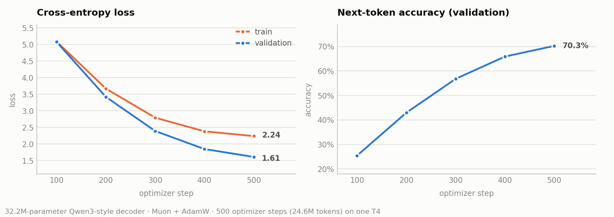

# qwen3.5-from-scratch

A **32.2M-parameter Qwen3-style decoder-only language model**, written from scratch in PyTorch and pretrained with the **Muon** optimizer on a single free-tier Colab **T4** — reaching **1.61 validation loss / 70.3% next-token accuracy in 11.6 minutes**.

No `transformers` modelling code: attention, grouped-query KV sharing, QK-Norm, rotary embeddings, SwiGLU, RMSNorm pre-norm, weight tying, the Muon optimizer and the training loop are all implemented in the notebook. Hugging Face is used only for the tokenizer and the dataset stream.



---

## Results

Single run, seed 42, one NVIDIA T4 (16 GB), fp16 mixed precision.

| Optimizer step | Val loss | Val accuracy | Val perplexity |
|---:|---:|---:|---:|
| 100 | 5.0751 | 25.43% | 159.98 |
| 200 | 3.4176 | 42.96% | 30.50 |
| 300 | 2.3895 | 56.79% | 10.91 |
| 400 | 1.8457 | 65.90% | 6.33 |
| **500 (final)** | **1.6079** | **70.26%** | **4.99** |

**Wall clock:** 11.6 min (~1.28 s per optimizer step, 4 gradient-accumulation micro-batches each)
**Throughput:** 49,152 tokens per optimizer step → 24.6M tokens seen in total
**Peak memory:** fits comfortably in the T4's 15.6 GB at `batch_size=24 × seq_len=512`

> In the loss chart the training curve sits *above* the validation curve. That is expected here, not a bug: the training number is a single micro-batch measured **with dropout active**, while validation is a 100-batch average in `eval()` mode.

See [Limitations](#limitations) before reading too much into the perplexity — the corpus is small and the split is window-level.

---

## Architecture

The block is the dense Qwen3 recipe: every component below is the one named in the [Qwen3 Technical Report](https://arxiv.org/abs/2505.09388) (§ Architecture), the design carried forward into the Qwen3.5 series.

| Component | Choice | Reference |
|---|---|---|
| Attention | Grouped-query attention, 8 query heads / 4 KV heads (2 queries per KV head) | [Ainslie et al., 2023](https://arxiv.org/abs/2305.13245) |
| QK normalization | Per-head RMSNorm on Q and K before RoPE — Qwen3 replaces Qwen2's QKV bias with this | [Henry et al., 2020](https://arxiv.org/abs/2010.04245) |
| Positional encoding | Rotary embeddings, applied to half the head channels | [Su et al., 2021](https://arxiv.org/abs/2104.09864) |
| Feed-forward | SwiGLU (`gate ⊙ up → down`) | [Shazeer, 2020](https://arxiv.org/abs/2002.05202) |
| Normalization | RMSNorm, pre-norm, ε = 1e-6 | [Zhang & Sennrich, 2019](https://arxiv.org/abs/1910.07467) |
| Biases | None on QKV or the output projection | [Qwen3 Technical Report](https://arxiv.org/abs/2505.09388) |
| Embeddings | Tied input/output embedding matrix (as in Qwen3 0.6B–4B) | [Qwen3 Technical Report](https://arxiv.org/abs/2505.09388) |
| Attention kernel | `F.scaled_dot_product_attention(..., is_causal=True)` (FlashAttention path) | — |

**Model dimensions**

| | |
|---|---|
| Layers | 6 |
| Model dim | 384 (8 heads × 48) |
| FFN dim | 1536 |
| Context | 512 tokens |
| Vocabulary | 49,152 ([SmolLM-135M tokenizer](https://huggingface.co/HuggingFaceTB/SmolLM-135M)) |
| Parameters | **32,150,976** total — 18.9M tied embedding + 13.3M non-embedding |

---

## Optimizer: Muon + AdamW

[Muon](https://kellerjordan.github.io/posts/muon/) takes the momentum update for a weight *matrix* and replaces it with its nearest orthogonal matrix, computed by a 5-step [Newton–Schulz](https://en.wikipedia.org/wiki/Newton%27s_method) iteration. Ordinary SGD/Adam updates are dominated by a few directions with large singular values; orthogonalizing keeps the direction of the update while flattening its spectrum, so every direction of the weight matrix learns at a comparable rate. It is the optimizer behind the current NanoGPT speedrun records and has been shown to scale to production LLM pretraining ([Liu et al., 2025](https://arxiv.org/abs/2502.16982)).

Muon only makes sense for 2D hidden weights, so the repo uses the standard **hybrid split**:

| Optimizer | Parameters | Count | LR |
|---|---|---:|---|
| Muon | attention & FFN matrices | 13,271,040 | 0.01 |
| AdamW | embeddings, RMSNorm gains, biases | 18,879,936 | 0.001 (wd 0.1) |

Both groups share one LR schedule (25 warmup steps, then cosine decay to 10% of peak), one `clip_grad_norm_(1.0)` call and one `GradScaler`.

Implementation details that matter:

- The Newton–Schulz iteration runs in **fp32**, not bf16. A T4 (SM 7.5) has no native bfloat16, so the usual bf16 formulation is either slow or unavailable there.
- The update is rescaled by `sqrt(max(1, fan_out / fan_in))` so differently shaped matrices receive comparably sized steps.
- Nesterov momentum (0.95) is applied to the raw gradient *before* orthogonalization.

---

## Training setup

| | |
|---|---|
| Data | [`HuggingFaceTB/smollm-corpus`](https://huggingface.co/datasets/HuggingFaceTB/smollm-corpus), `cosmopedia-v2` config, streamed |
| Corpus | 2,000 documents → 500,000 tokens (cached to disk as a flat token stream) |
| Windows | stride-1 sliding windows of 512 tokens → 449,540 train / 49,948 val |
| Batch | 24 × 4 gradient-accumulation steps = 49,152 tokens per update |
| Steps | 500 optimizer updates (≈ 49 passes over the token stream) |
| Precision | fp16 autocast + `GradScaler` |
| Seed | 42 (`cudnn.deterministic = True`) |

---

## Quickstart

**Colab (recommended — this is what the results above came from):**

1. Open `qwen3_5_from_scratch.ipynb` in Colab and select a T4 GPU runtime.
2. Run all cells. The data cell streams and tokenizes ~2k documents (about 30 s) and caches the result to `./cache`, so re-runs skip tokenization.
3. Training writes `best_model.pt` at each new best validation loss and `final_model.pt` at the end.

**Local:**

```bash
git clone https://github.com/<your-username>/qwen3.5-from-scratch.git
cd qwen3.5-from-scratch
pip install -r requirements.txt
jupyter notebook qwen3_5_from_scratch.ipynb
```

**Sampling from a checkpoint:**

```python
model, config = load_trained_model("final_model.pt")
print(generate_text(model, tokenizer, "The mitochondria", max_new_tokens=100, temperature=0.8, top_k=50, top_p=0.9))
```

---

## Repo structure

```
qwen3.5-from-scratch/
├── qwen3_5_from_scratch.ipynb   # model, Muon, data pipeline, training loop, sampling
├── FIXES.md                     # engineering log: every defect found while getting this to train
├── assets/training_curves.png
├── requirements.txt
└── README.md
```

---

## Implementation notes

The parts that are easy to get subtly wrong, and how this implementation handles them:

**RoPE is applied on the time axis, before the head transpose.** `Rotary` indexes the sequence at `dim=-3`, so it expects `(B, T, H, D)` tensors. Rotating tensors that have already been transposed to `(B, H, T, D)` still runs, still trains, and still produces plausible-looking loss curves — it just rotates across *heads* instead of positions, silently destroying positional information. The tensors here are rotated first and transposed second, and the notebook's shape comments state which layout each line is in.

**GQA group count is derived, not configured twice.** `n_kv_groups = n_heads // n_kv_heads` lives in `__post_init__` next to the divisibility assertions, so `n_kv_heads` always means "number of KV heads" and never accidentally becomes the group count. `repeat_kv` expands each KV head to its query group via `expand` + `reshape` (a view, not a copy, until reshape materializes it).

**QK-Norm is per head.** The RMSNorm is over `d_k`, applied after the `view(B, T, H, d_k)` and before RoPE — the order the Qwen3 report specifies.

**One `step` means one optimizer update.** With gradient accumulation it is easy to let the step counter tick per micro-batch, which quietly divides the LR schedule, the eval cadence and `max_steps` by the accumulation factor — a 500-step cosine schedule that only ever reaches 25% of its curve. The loop here pulls `gradient_accumulation_steps` micro-batches from an endless iterator per step, so every consumer of `step` speaks the same unit.

**One AMP code path.** `GradScaler(enabled=config.use_amp)` no-ops when AMP is off, so there is no duplicated fp16/fp32 branch to keep in sync. Gradients are unscaled before clipping, as they must be for `clip_grad_norm_` to see true norms.

**Generation crops to the context window.** The model has no KV cache, so each step re-runs the last `max_seq_len` tokens; without the crop, sampling past 512 tokens would index past the rotary buffer.

**Weight tying is explicit.** The LM head is `F.linear(x, self.token_embedding.weight)` rather than a separate `nn.Linear`, so there is exactly one embedding matrix — and it stays in the AdamW group, since Muon is for hidden layers only.

### Verification

Rather than trusting the loss curve, the implementation was checked directly:

- **Causality** — perturbing the last token of a sequence leaves all earlier logits bit-identical.
- **RoPE** — with identical content at every position, `⟨y_i, y_j⟩` depends only on `j − i` (this test fails loudly if the rotation is applied to the wrong axis).
- **Newton–Schulz** — singular values of the orthogonalized update land in ≈ [0.69, 1.10] for random matrices, i.e. the iteration really is approximating an orthogonal factor.
- **Optimizer** — every matrix parameter moves after one `Muon.step()` and stays finite.
- **Round-trip** — checkpoint saves and reloads under `weights_only=True`, and generation runs past the context window.

The defects these checks were written against are catalogued in [FIXES.md](FIXES.md).

---

## Limitations

Stated plainly, because the headline perplexity is flattering:

- **The corpus is tiny.** 500k tokens seen ~49 times is repetition, not pretraining. A 4.99 perplexity here is not comparable to a model trained on billions of unique tokens.
- **The validation split is window-level, not document-level.** `random_split` over stride-1 sliding windows means a validation window can overlap a training window by up to 511 tokens. A document-level split would be the honest measurement.
- **No KV cache.** Sampling is O(n²) — fine for demos, wrong for anything real.
- **Scope.** No MoE, no sliding-window attention, no long-context RoPE scaling, no post-training — this is the dense Qwen3 *block*, not the Qwen3 *system*.

### Next steps

- Document-level train/val split and a fixed held-out set
- Incremental KV cache for generation
- Muon vs. AdamW-only ablation at matched wall-clock
- Larger token budget (100M+) to see whether the Muon advantage holds past the memorization regime

---

## References

- An Yang et al. **Qwen3 Technical Report.** arXiv:2505.09388, 2025. https://arxiv.org/abs/2505.09388
- Qwen Team. **Qwen3.5: Towards Native Multimodal Agents.** https://qwen.ai/blog?id=qwen3.5 · **Qwen3.5-Omni Technical Report**, arXiv:2604.15804. https://arxiv.org/abs/2604.15804
- Keller Jordan et al. **Muon: An optimizer for hidden layers in neural networks.** 2024. https://kellerjordan.github.io/posts/muon/
- Jingyuan Liu et al. **Muon is Scalable for LLM Training.** arXiv:2502.16982, 2025. https://arxiv.org/abs/2502.16982
- Jianlin Su et al. **RoFormer: Enhanced Transformer with Rotary Position Embedding.** arXiv:2104.09864, 2021. https://arxiv.org/abs/2104.09864
- Joshua Ainslie et al. **GQA: Training Generalized Multi-Query Transformer Models from Multi-Head Checkpoints.** arXiv:2305.13245, 2023. https://arxiv.org/abs/2305.13245
- Alex Henry et al. **Query-Key Normalization for Transformers.** Findings of EMNLP 2020, arXiv:2010.04245. https://arxiv.org/abs/2010.04245
- Noam Shazeer. **GLU Variants Improve Transformer.** arXiv:2002.05202, 2020. https://arxiv.org/abs/2002.05202
- Biao Zhang, Rico Sennrich. **Root Mean Square Layer Normalization.** arXiv:1910.07467, 2019. https://arxiv.org/abs/1910.07467
- Loubna Ben Allal et al. **SmolLM corpus** (cosmopedia-v2). https://huggingface.co/datasets/HuggingFaceTB/smollm-corpus

---

## License

MIT — see [LICENSE](LICENSE).
